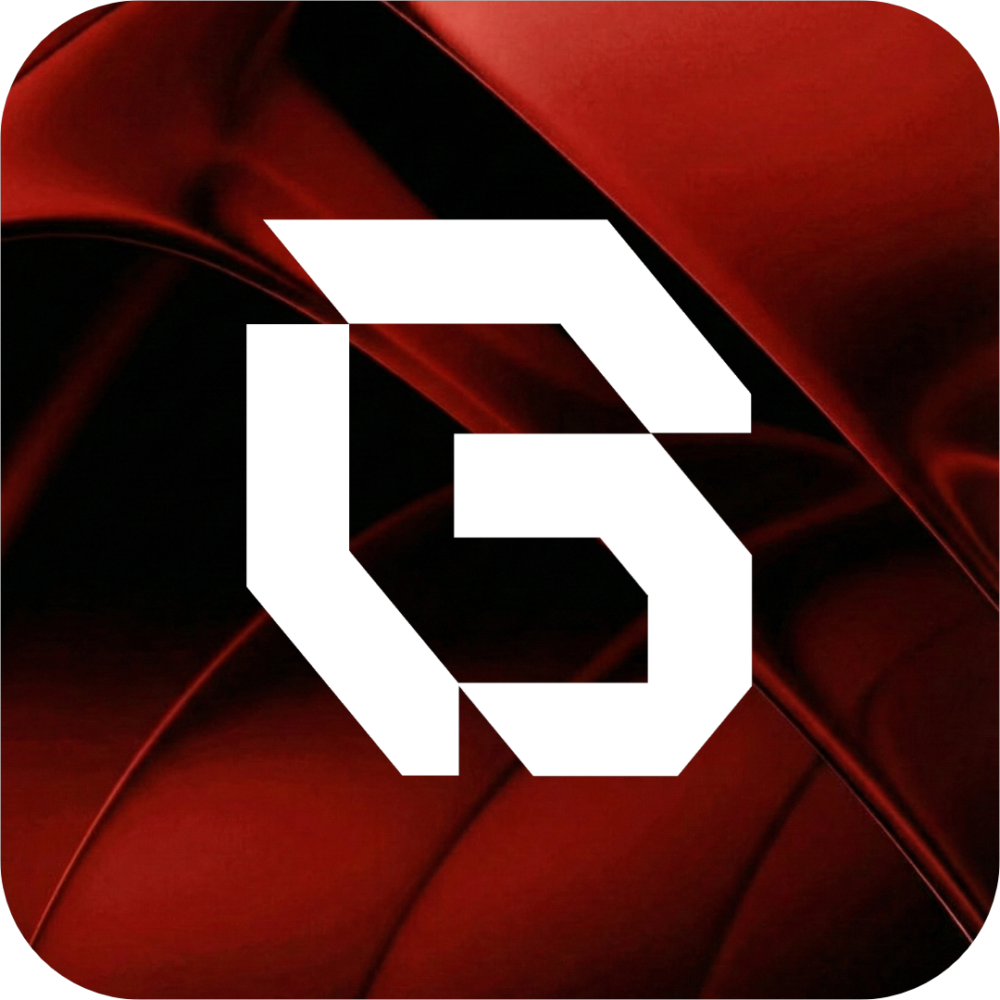
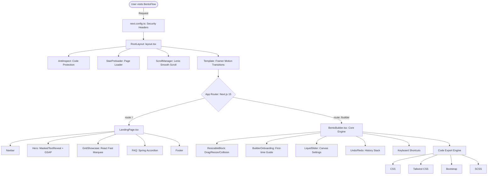

<div align="center">



# BentoFlow

**Craft beautiful bento grids in seconds. Export production-ready code instantly.**

[](https://bento-flow.vercel.app/)
[](https://nextjs.org/)
[](https://tailwindcss.com/)
[](LICENSE)

<br/>


<br/>

_Design tool for developers who want to create stunning, responsive bento grid layouts._

</div>

---

##  Support the Project

If BentoFlow has helped you build faster, consider supporting development:

<div align="center">

[](https://saweria.co/rfkisctt)

</div>

Your support helps us keep BentoFlow free for everyone.

---

##  Features

###  Visual Grid Builder

- **Drag & Drop**: Intuitive click-and-drag interface to resize, move, and arrange blocks on a live canvas
- **Liquid Physics Engine**: Smart collision detection ensures blocks never overlap; they intelligently shift to maintain a clean layout
- **Real-time Preview**: Toggle between edit and preview mode to see your final grid without guidelines
- **Customizable Canvas**: Adjust columns, rows, gap spacing, and border radius to match your design system

###  One-Click Code Export

-  **CSS**: Clean, vanilla CSS grid code
-  **Tailwind CSS**: Utility-first classes ready to paste into your project
-  **Bootstrap**: Bootstrap-compatible grid markup
-  **SCSS**: Sass-powered stylesheets with variables and nesting

###  Smart Workflow

- **Full Undo/Redo History**: Never lose your progress with `Ctrl+Z` / `Ctrl+Y`
- **Keyboard Shortcuts**: Power-user commands for duplicating, moving, resizing, and deleting blocks
- **Block Selection**: Click to select, arrow keys to move, Shift+Arrow to resize
- **Copy & Paste Blocks**: Duplicate layouts with `Ctrl+C` / `Ctrl+V`

###  Fully Responsive

- **Mobile-First Design**: Every component scales gracefully from 375px to 1440px+
- **Adaptive UI**: Icon-only toolbar buttons on mobile, bottom-sheet settings panel, single-column modals
- **iOS Safe**: Proper text-size-adjust and touch-friendly tap targets

###  Built-in Security

- **Source Map Protection**: Production builds ship without source maps
- **Anti-Inspect**: Right-click disabled, DevTools shortcuts blocked, image drag prevented
- **Security Headers**: X-Frame-Options, X-Content-Type-Options, XSS Protection, Referrer Policy, and more
- **Powered-By Hidden**: No server framework fingerprinting

---

##  Tech Stack

| Layer             | Technology                                                                  |
| ----------------- | --------------------------------------------------------------------------- |
| **Framework**     | [Next.js 16](https://nextjs.org/) (App Router + Turbopack)                  |
| **Styling**       | [Tailwind CSS 4](https://tailwindcss.com/)                                  |
| **Animations**    | [Framer Motion](https://www.framer.com/motion/) + [GSAP](https://gsap.com/) |
| **Smooth Scroll** | [Lenis](https://lenis.darkroom.engineering/)                                |
| **Icons**         | [Lucide React](https://lucide.dev/)                                         |
| **Marquee**       | [React Fast Marquee](https://www.react-fast-marquee.com/)                   |
| **Language**      | TypeScript                                                                  |
| **Deployment**    | [Vercel](https://vercel.com/)                                               |

---

##  Getting Started

### Prerequisites

- **Node.js** 18+
- **npm**, **yarn**, **pnpm**, or **bun**

### Installation

```bash
# Clone the repository
git clone https://github.com/rfkisctt/bento-flow.git

# Navigate to the project
cd bento-flow

# Install dependencies
npm install

# Start the development server
npm run dev
```

Open [http://localhost:3000](http://localhost:3000) to see the landing page, then navigate to `/builder` to start creating grids.

### Build for Production

```bash
npm run build
npm start
```

---

##  Keyboard Shortcuts

| Action           | Shortcut             |
| ---------------- | -------------------- |
| Undo             | `Ctrl + Z`           |
| Redo             | `Ctrl + Y`           |
| Duplicate Block  | `Ctrl + D`           |
| Copy Block       | `Ctrl + C`           |
| Paste Block      | `Ctrl + V`           |
| Move Block       | `Arrow Keys`         |
| Resize Block     | `Shift + Arrow Keys` |
| Next Block       | `Tab`                |
| Delete Block     | `Delete`             |
| Deselect / Close | `Escape`             |

---

##  Architecture



> [!NOTE]
> The architecture follows the **Next.js App Router** pattern. The `RootLayout` wraps every page with global providers (scroll management, preloader, code protection), while the `Template` component handles animated page transitions between routes.

---

##  Project Structure

```
bento-flow/
├── app/
│   ├── builder/           # Builder page (/builder)
│   ├── components/
│   │   ├── landing/       # Landing page components
│   │   │   ├── Navbar.tsx
│   │   │   ├── Hero.tsx
│   │   │   ├── Footer.tsx
│   │   │   ├── SectionComponents.tsx
│   │   │   └── grid-showcase.tsx
│   │   ├── design/        # Design elements (SelectionBox)
│   │   └── ui/            # Reusable UI (LiquidSlider, MaskedTextReveal)
│   ├── globals.css
│   ├── layout.tsx
│   ├── page.tsx           # Landing page (/)
│   └── template.tsx       # Page transition wrapper
├── components/
│   ├── bento-builder.tsx  # Core builder engine
│   ├── resizable-block.tsx
│   ├── builder-onboarding.tsx
│   ├── bento-constants.ts
│   ├── anti-inspect.tsx   # Code protection
│   └── stair-preloader.tsx
├── public/
│   ├── bentoflow.png      # Logo
│   ├── poster.png         # OG Image
│   └── vid_landing.mp4    # Hero video
└── next.config.ts         # Security headers & config
```

---

##  License

Copyright (c) 2026 [rfkisctt](https://github.com/rfkisctt).

This project is licensed under a **Proprietary License**. You are free to view and learn from the code, and use it for personal, non-commercial purposes. However, you are **not** permitted to:

- **Modify & Redistribute**: You may not redistribute the source code or modified versions of it.
- **Commercial Use**: You may not sell, lease, or commercialize the Software or any part of its source code.
- **Branding**: You may not claim ownership or use the Branding for commercial gain.

> [!IMPORTANT]
> The **core builder engine** is proprietary software. For licensing inquiries or commercial permissions, please [contact me](mailto:jorrviklvy@gmail.com).

For full details, see the [LICENSE](LICENSE) file.

---

##  Contact & Socials

<div align="center">

[](https://bento-flow.vercel.app/)
[](https://github.com/rfkisctt/bento-flow)

**Need help?** Open an [Issue](https://github.com/rfkisctt/bento-flow/issues) or reach out via email for support.

<br/>

_BentoFlow © 2026. All rights reserved._

</div>
